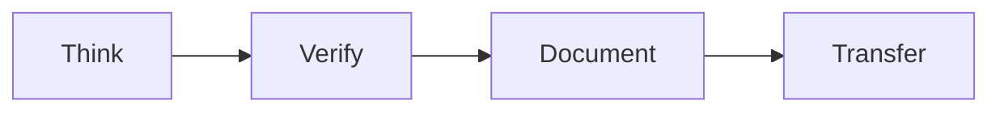
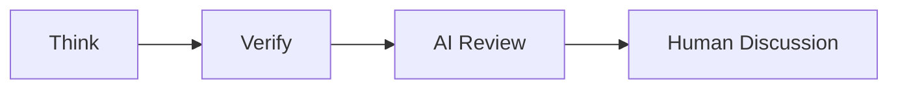
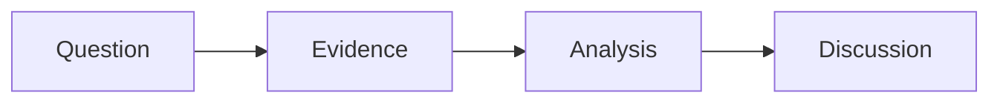

## Research Playbook

> **How do we conduct research?**
> This document describes the research lifecycle, research workflow, daily practice, working with AI, working with the others, and research outcomes.

---

## Why?

Research is not simply a collection of experiments.

Successful research is a structured process that transforms ideas into reproducible knowledge.

Without a clear workflow, researchers often:
- Start coding before understanding the problem.
- Run experiments without clear hypotheses.
- Collect results without sufficient evidence.
- Produce documentation that others cannot follow.
- Leave knowledge that cannot be transferred.

The purpose of this playbook is not to prescribe every step of research.

Instead, it provides a common workflow that helps researchers:
- Think before acting.
- Verify before believing.
- Document before forgetting.
- Transfer before leaving.

A good workflow reduces unnecessary trial and error, improves research quality, and enables the next researcher to continue the work.

---

### 1. Research Lifecycle

Every research project follows a common workflow.

Although research topics differ, successful research projects usually progress through the same stages:


Every research activity should follow this lifecycle.

---

### 2. Daily Practice
**Daily action must align with short-term goals.**

Research should be driven by plans rather than random actions.

Every working day consists of two stages:
1. **Plan before taking actions** (at the beginning of the day)
2. **Review before leaving** (at the end of the day)


#### 1. Morning: Plan before taking actions

The first task after arriving at the laboratory is **planning**.

**Before taking any action, define a clear plan for the day.**

Your daily plan should answer:
- What is today's objective, and how does it relate to my short-term goal?
- Why is it important?
- What evidence do I expect to obtain?
- What is the expected outcome?
- What risks or blockers may occur?

**Do not start coding or experiments without a plan.**

#### 2. Evening: Review before leaving

Before leaving the laboratory, review the day's progress.

Your daily report should answer:
- **Think**: What was the biggest problem today? | 今天最大的問題是？
- **Verify**: What did I verify today? | 今天驗證了什麼？
- **Document**: What did I document today? | 今天留下了什麼紀錄？
- **Transfer**: If I leave today, can someone else continue my work? | 如果今天離開，別人能接嗎？

Finally, compare the morning plan with the actual outcomes.

Ask yourself:
- Which planned tasks were completed?
- Which tasks were not completed?
- Why?
- Does tomorrow's plan need to be adjusted?

#### AI-assisted Reflection | AI 幫助學生自評

Before submitting the daily report, use an AI coach to review your work.

The purpose of the AI coach is to help the student evaluate themselves.

For the latest AI Coach Prompt, please refer to:

Appendix E — AI Research Coach Prompt

Students should revise the daily report based on the AI coach's feedback before submitting it.

---
### 3. Research Workflow

Research should not begin with coding, experiments, or AI-generated implementation.

Many research projects fail not because students do not work hard, but because they start implementation before clarifying the design.

When the design is unclear, students may spend a lot of time:
- trying random approaches,
- asking AI to write code without understanding the system,
- running experiments without clear assumptions,
- collecting results that are difficult to explain,
- and drifting away from the original research direction.

To avoid this, every research task should begin with a short design document and meeting notes.

#### Phase 1: Design Before Experiment

Before implementation, clarify the research design.

```mermaid
graph LR
    Q[Question] --> BK[Background Knowledge]
    BK --> A[Assumptions]
    A --> D[Design Document]
    D --> C[Advisor Confirmation]
````

The design document does not need to be long, but it should clearly explain:
* The problem statement
* The required background knowledge
* The system assumptions
* The proposed method
* Why the method is reasonable
* The expected result
* The verification plan
* The risks or unknowns

After each meeting, students should update the meeting notes and revise the design document before continuing implementation.

#### Phase 2: Experiment After Design Confirmation

After the design is confirmed, implementation and experiments can begin.

```mermaid
graph LR
    H[Hypothesis] --> E[Experiment]
    E --> V[Verification]
    V --> DOC[Documentation]
    DOC --> KT[Knowledge Transfer]
```

Experiments should verify the design, not replace the design.

Before running experiments, ask:
* What hypothesis am I testing?
* What evidence should the experiment produce?
* How will I know whether the result supports the design?
* What should be documented for the next researcher?

Do not ask AI to write code before the design is clear.

AI can help review the design, identify missing assumptions, and suggest verification methods, but it should not replace the researcher's responsibility to understand the problem.

---
### 4. Working with AI
AI should be used to improve research quality rather than replace research thinking.

The recommended workflow is:


---

### 5. Research Collaboration



---

### 6. Research Outcomes
Research should produce reusable knowledge.

Typical research outcomes include:
- Papers and theses
- Source code
- Datasets
- Documentation
- Reproducible experiments
- Technical knowledge

---

## Final Message

**Every researcher leaves knowledge.**

**Every project leaves experience.**

**Every laboratory leaves culture.**

---

🧠 Think

🔬 Verify

📝 Document

🤝 Transfer

> **Research is complete only when it can be reproduced and transferred.**
