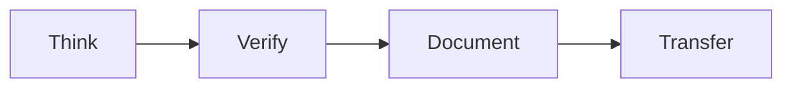
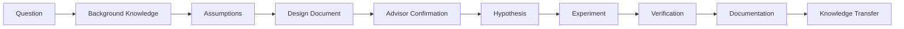
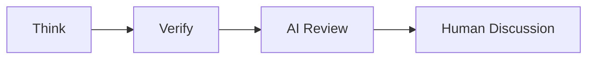
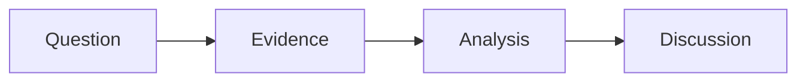

## Research Playbook

> >**How do we conduct research?**
> >This document describes the research lifecycle, research workflow, daily practice, working with AI, working with the others, and research outcomes.

### 1. Research Lifecycle

Every research project follows a common workflow.

Although research topics differ, successful research projects usually progress through the same stages:

Every research activity should follow this lifecycle.

### 2. Research Workflow

Research should not begin with coding or experiments.

Before writing code, running tests, or asking AI to generate a solution, the researcher should first clarify the design:

- What problem are we solving?
- What background knowledge is required?
- What assumptions are we making?
- Why is this method reasonable?
- What should be verified?
- What evidence will show that the design works?

A poorly defined design often leads to wasted time, random experiments, and results that are difficult to explain or reproduce.

Therefore, every research task should start with a short design document and meeting notes before implementation.

The design document does not need to be long, but it should clearly explain:

* The problem statement
* The system assumptions
* The proposed method
* The expected result
* The verification plan
* The risks or unknowns

After each meeting, students should update the meeting notes and revise the design document before continuing implementation.

Do not ask AI to write code before the design is clear.

AI can help review the design, identify missing assumptions, and suggest verification methods, but it should not replace the researcher's responsibility to understand the problem.

### 3. Daily Practice
Your daily report should contain the answers to the following questions:
- **Think**: What is the biggest problem today? | 今天最大的問題是？
- **Verify**: What do I verify today? | 今天驗證了什麼？
- **Document**: Whay do I leave today? |今天留下了什麼？
- **Transfer**: If I leave today, can someone else continue my work? | 如果今天離開，別人能接嗎？

### 4. Working with AI
AI should be used to improve research quality rather than replace research thinking.

The recommended workflow is:

### 5. Research Collaboration

### 6. Research Outcomes
Research should produce reusable knowledge.

Typical research outcomes include:
- Papers and theses
- Source code
- Datasets
- Documentation
- Reproducible experiments
- Technical knowledge

## Final Message

**Every researcher leaves knowledge.**

**Every project leaves experience.**

**Every laboratory leaves culture.**

---

🧠 Think

🔬 Verify

📝 Document

🤝 Transfer

> **Research is complete only when it can be reproduced and transferred.**
