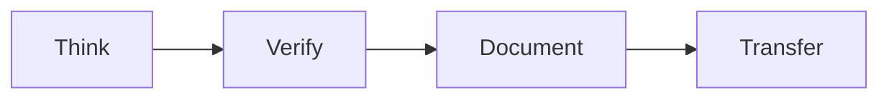
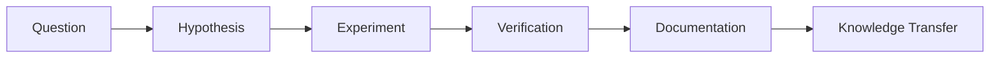
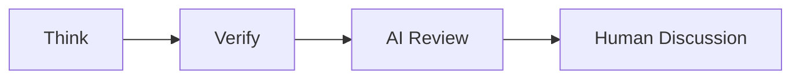
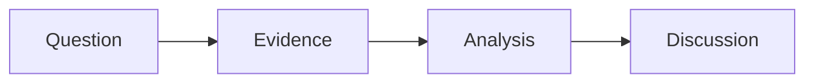

## Research Playbook

> >**How do we conduct research?**
> >This document describes the research lifecycle, research workflow, daily practice, working with AI, working with the others, and research outcomes.

### 1. Research Lifecycle

Every research activity should follow this lifecycle.

### 2. Research Workflow

### 3. Daily Practice
Your daily report should contain the answers to the following questions:
- **Think**: What is the biggest problem today? | 今天最大的問題是？
- **Verify**: What do I verify today? | 今天驗證了什麼？
- **Document**: Whay do I leave today? |今天留下了什麼？
- **Transfer**: Can I handover my job to the others if I leave today? |如果今天畢業，別人能接嗎？

### 4. Working with AI

### 5. Working with Others

### 6. Research Outcomes
- Paper/Thesis
- Code
- Data
- Documentation
- Duplicable Experiment Results
- Knowledge

## Final Message

**Good research creates knowledge. Great research leaves knowledge behind.**

**好的研究創造知識；偉大的研究留下知識。**

---

🧠 Think

🔬 Verify

📝 Document

🤝 Transfer

> **Research is complete only when it can be reproduced and transferred.**
