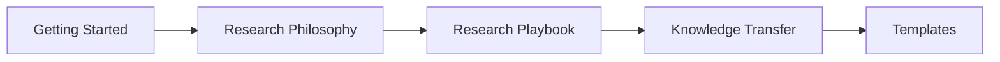

## Getting Started

> **Where should I start?**
>
> Welcome to the Open Research Playbook.
>
> This guide helps new researchers quickly find the right starting point.
>
> You do not need to read everything at once.
>
> Start here.

### Repository Roadmap


> Follow the documents in this order. Each document builds upon the previous one.

---

### Step 1 — Understand Our Research Philosophy

Before conducting research, understand how we think.

Read:

* [README.md](README.md)
* [01-research-philosophy.md](01-research-philosophy.md)

---

### Step 2 — Learn Our Research Workflow

Understand how research is conducted in the laboratory.

Read:

* [02-research-playbook.md](02-research-playbook.md)

---

### Step 3 — Meet Your Advisor/Mentor

Before writing code or running experiments, meet your advisor.

During the meeting, make sure you know:

* Your research topic
* Your short-term goal
* Your Minimum Reproducible Result (MRR)
* Where the project is located
* Which documents you should read first

Record the meeting using:

* [Appendix F — Meeting Notes](templates/F-meeting-notes.md)

---

### Step 4 — Verify Your Research Environment

Checklist:
- [ ] GitHub repository can be cloned.
- [ ] Overleaf project can be opened.
- [ ] pCloud folder is accessible.
- [ ] The project can be built or executed.

---

### Step 5 — Reproduce Before Extending

Before proposing new ideas or writing new code:

Reproduce the Minimum Reproducible Result (MRR).

For details, read:

* [10-knowledge-transfer.md](10-knowledge-transfer.md)

---

### Step 6 — Start Your Daily Research

Every working day should follow the same workflow:

```text
Morning Plan
      ↓
Research
      ↓
Daily Report
      ↓
AI Self-review
```

For details, read:

* [02-research-playbook.md](02-research-playbook.md)

---

### First Week Checklist

By the end of your first week, you should be able to:

* [ ] Explain your research in five minutes.
* [ ] Access GitHub, Overleaf, and pCloud.
* [ ] Reproduce the MRR.
* [ ] Submit one AI-reviewed daily report.
* [ ] Improve one document, script, or experiment.

---

## You're Ready

If you can complete the First Week Checklist, you are ready to contribute to the laboratory.

Continue your research using:
- Research Playbook [02-research-playbook.md](02-research-playbook.md)
- Knowledge Transfer [10-knowledge-transfer.md](10-knowledge-transfer.md)
- Templates [templates/](templates) directory.

---

> **Don't try to learn everything.**
>
> **Learn enough to take the next step.**
