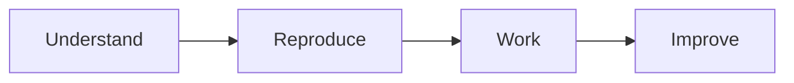
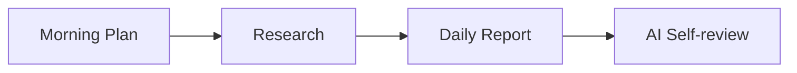

## Student Onboarding

> **How should a new researcher start?**
>
> Welcome to the BMW Lab.
>
> This guide helps new researchers get started quickly and confidently.
>
> It is designed for:
> * New graduate students
> * Local undergraduate interns
> * International TEEP interns

---

### Why?

Research can be overwhelming when you first join a laboratory.

You may receive papers, repositories, datasets, meeting notes, and many new concepts all at once.

You are **not** expected to learn everything during your first week.

Instead, your goal is simple:

> **Understand the research, reproduce one result, and become ready to contribute.**

This guide shows you where to start.

Detailed explanations are provided in the linked documents.

---

### Your First Week

---

### Step 1 — Understand

Start by understanding how the laboratory conducts research.

Read the following documents in order:

1. [README.md](README.md)
2. [01-research-philosophy.md](01-research-philosophy.md)
3. [02-research-playbook.md](02-research-playbook.md)

Your goal is **not** to memorize every detail.

Instead, understand the core philosophy:

> **Research is not complete until someone else can continue it.**

---

### Step 2 — Receive Your Research Assignment

Meet your advisor.

Complete:

* [Appendix A — Research Assignment](appendix/A-research-assignment.md)

After the meeting, you should know:

* Your research topic
* Your advisor
* Your short-term goal
* Your first reproducible experiment
* The repositories and documents you should read

---

### Step 3 — Access Research Resources

Make sure you can access all required laboratory resources.

#### Source Code

* Laboratory GitHub Organization

#### Documents

* Overleaf (Paper / Thesis)
* Laboratory pCloud

#### Research Materials

* Defense slides
* Design documents
* README
* Meeting notes
* Experimental results

---

### Step 4 — Reproduce the Minimum Reproducible Result (MRR)

Before writing new code or proposing new ideas:

Reproduce the minimum experimental result.

Your goal is to answer one question:

> **Can I reproduce the existing work?**

If not, record your findings and discuss them with your advisor.

For details, see:

* [10-knowledge-transfer.md](10-knowledge-transfer.md)

---

### Step 5 — Start Your Daily Research Workflow

Every working day follows the same cycle.

Before starting work:

* Create today's plan.

Before leaving:

* Submit your daily report.
* Review it using AI.

For details, see:

* [02-research-playbook.md](02-research-playbook.md)
* [Appendix E — AI Daily Self-review Prompt](appendix/E-daily-self-review-prompt.md)

---

### Step 6 — Ask Better Questions

When asking for help, always provide evidence.

A good question should include:
- What you tried
- What you expected
- What actually happened
- What evidence you collected
- What you think the cause might be
- What are your top three options

For the complete workflow, see:

* [02-research-playbook.md](02-research-playbook.md)

---

### Step 7 — Improve the Project

Every researcher should leave the project better than they found it.

Examples include:
- Improve the documentation.
- Improve the README.
- Improve reproducibility.
- Improve the experiments.
- Improve the code.

Even small improvements help future researchers.

---

### First Week Checklist

By the end of your first week, you should be able to complete the following checklist.
- [ ] Read the Open Research Playbook.
- [ ] Meet your advisor.
- [ ] Complete your Research Assignment.
- [ ] Access GitHub, Overleaf, and pCloud.
- [ ] Read the assigned research materials.
- [ ] Reproduce the Minimum Reproducible Result (MRR).
- [ ] Submit one daily plan.
- [ ] Submit one AI-reviewed daily report.
- [ ] Ask one evidence-based question.
- [ ] Improve one document, script, or experiment.

---

### Next Steps

Once you have completed onboarding, continue with:
* [02-research-playbook.md](02-research-playbook.md)
* [10-knowledge-transfer.md](10-knowledge-transfer.md)

As your research progresses, you will also use:
* [Appendix B — Knowledge Transfer Checklist](appendix/B-knowledge-transfer-checklist.md)
* [Appendix C — Verification Report](appendix/C-verification-report.md)
* [Appendix D — Acceptance Form](appendix/D-acceptance-form.md)

---

## Final Message

You are not expected to know everything during your first week.

You are expected to learn how to learn.

> **Think before acting.**
>
> **Verify before believing.**
>
> **Document before forgetting.**
>
> **Transfer before leaving.**

Every researcher starts as a newcomer.

Every experienced researcher was once successfully onboarded.
