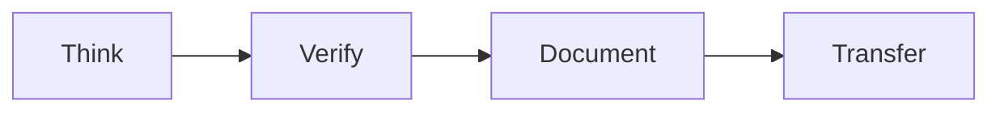
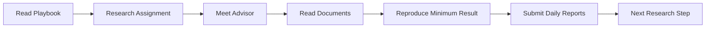
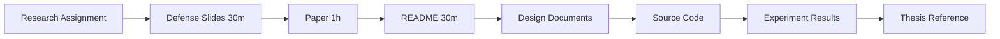

## Student Onboarding

> **How should a new researcher start?**
>
> This document helps new researchers start their work in the laboratory.
>
> It is designed for:
>
> - International TEEP interns
> - Local undergraduate interns
> - New graduate students

---

### Why?

A new researcher should not begin by randomly reading papers, writing code, or asking AI to generate solutions.

Before starting research work, every new researcher should understand:

- How the laboratory conducts research
- What research direction they are assigned to
- What documents and repositories they should read first
- How to report progress
- How to ask questions with evidence
- How knowledge should eventually be transferred

The goal of onboarding is simple:

> **Help the new researcher start correctly and avoid wasting time in the wrong direction.**

The purpose of onboarding is not to teach everything. It is to help every new researcher achieve their first successful week in the laboratory.

---

### Onboarding Philosophy

New researchers should follow the same research lifecycle as everyone else.



During onboarding, this means:
- Think: Understand the research direction before taking action.
- Verify: Reproduce existing results before proposing new changes.
- Document: Record what you learn, install, test, and verify.
- Transfer: Leave notes that help the next researcher.

### Onboarding Path



### First Week Milestones

The goal of onboarding is **not** to start new research immediately.

The goal is to understand the existing research and become productive as quickly as possible.

By the end of the first week, every new researcher should be able to complete the following milestones.

| Milestone                                 | Expected Evidence                            |
| ----------------------------------------- | -------------------------------------------- |
| Read the Open Research Playbook           | Able to explain the four research principles |
| Complete the Research Assignment          | Approved Appendix A                          |
| Read the assigned research materials      | Thesis, paper, defense slides, README        |
| Clone the laboratory GitHub repository    | Repository URL and latest commit             |
| Access the laboratory pCloud folder       | Shared folder link                           |
| Access Overleaf project                   | Paper / Thesis link                          |
| Reproduce the minimum experimental result | Logs, screenshots, or figures                |
| Submit daily plans and daily reports      | Daily reports reviewed by AI                 |
| Meet the advisor                          | Research direction confirmed                 |

A new researcher is considered successfully onboarded when these milestones have been completed.


### Step 1: Read the Foundation Documents

New researchers should first read:
| Document                                               | Purpose                                                 |
| ------------------------------------------------------ | ------------------------------------------------------- |
| [README.md](README.md)                                 | Understand what this repository is about                |
| [01-research-philosophy.md](01-research-philosophy.md) | Understand why we conduct research this way             |
| [02-research-playbook.md](02-research-playbook.md)     | Understand how we conduct research                      |
| [10-knowledge-transfer.md](10-knowledge-transfer.md)   | Understand how research knowledge should be transferred |

You do not need to memorize every document.

> You should understand the core idea:
> Research is not complete until someone else can continue it.

### Step 2: Confirm Your Research Assignment

Before starting work, complete:
| Template                                                              | Purpose                                                           |
| --------------------------------------------------------------------- | ----------------------------------------------------------------- |
| [Appendix A — Research Assignment](appendix/A-research-assignment.md) | Clarify responsibility, research scope, and expected deliverables |

The assignment should clarify:
- Research topic
- Advisor
- Expected duration
- Expected outcomes
- First reading materials
- First reproducibility target

Do not start implementation before your research assignment is clear.

### Step 3: Read Existing Materials

After assignment, read the materials provided by the advisor or previous researcher.

Important materials may include:
- Thesis or paper
- Defense slides
- Design documents
- Meeting notes
- README
- Source code repository
- Experimental results
- Logs, figures, and screenshots



For international researchers, English materials should be prioritized whenever possible.

If the thesis is written in Chinese, use supporting materials such as English slides, papers, diagrams, README files, and AI-assisted summaries to understand the work.


### Step 4: Reproduce the Minimum Reproducible Result (MRR)

Before proposing new ideas or writing new code, first reproduce the minimum existing result.

Ask:
- What is the minimum experiment I should reproduce?
- What output should I obtain?
- What evidence should I collect?
- What error logs or screenshots should I keep?
- What assumptions must I verify?

Do not begin extension work before reproducing the minimum result.

### Step 5: Plan Before Taking Actions

At the beginning of each working day, write a short plan.

Your daily plan should answer:
- What is today's objective, and how does it relate to my short-term goal?
- Why is it important?
- What evidence do I expect to obtain?
- What is the expected outcome?
- What risks or blockers may occur?

The first task after arriving at the laboratory is not coding.

It is planning.

### Step 6: Review Before Leaving

Before leaving the laboratory, submit a daily report.

Your daily report should answer:
- Think: What was the biggest problem today?
- Verify: What did I verify today?
- Document: What did I document today?
- Transfer: If I leave today, can someone else continue my work?

Then compare the morning plan with actual outcomes.

Ask:
- Which planned tasks were completed?
- Which tasks were not completed?
- Why?
- Does tomorrow's plan need to be adjusted?

### Step 7: Use AI for Self-review

Before submitting your daily report, use an AI coach to review your work.

Use:

|Template	| Purpose |
|Appendix E — AI Daily Self-review Prompt	| Help students compare plan, action, evidence, and outcome|

AI should help you identify:
- Missing evidence
- Weak reasoning
- Unclear assumptions
- Unfinished tasks
- Deviations from the original plan
- Risks for reproducibility or knowledge transfer

AI is not used to replace thinking.

AI is used to improve self-review.

### Step 8: Ask Better Questions

Before asking the advisor, senior students, or teammates for help, prepare:
```mermid
graph LR
    Q[Question] --> E[Evidence]
    E --> A[Analysis]
    A --> D[Discussion]
```

A good question should include:
- What you tried
- What you expected
- What actually happened
- What evidence you collected
- What you think the cause might be
- What decision or help you need
- What are your top-three options

Avoid asking only:
- It does not work. What should I do?

Instead, ask with evidence.

### Step 9: Leave Knowledge Behind

Even during onboarding, you should document what you learn.

Useful notes include:
- Installation notes
- Error logs and solutions
- Reproduction steps
- Missing assumptions
- Useful links
- Questions and answers
- AI summaries that were verified by you

Every new researcher should leave the project easier to understand than when they received it.

### Onboarding Checklist
- [ ] Explain the research in 5 minutes.
- [ ] Reproduce the minimum result.
- [ ] Ask one evidence-based question.
- [ ] Submit one AI-reviewed daily report.
- [ ] Improve one document.

## Final Message

Onboarding is not just learning what to do.

It is learning how to become a researcher.

> Think before acting.
> Verify before believing.
> Document before forgetting.
> Transfer before leaving.

Every new researcher should start by learning how to enable the next researcher.
