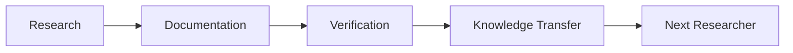
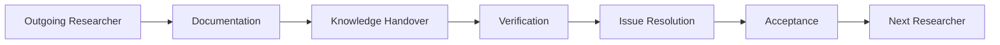

## Knowledge Transfer

> **How do we transfer research knowledge?**
>
> This document describes the principles, workflow, responsibilities, and verification process for transferring research knowledge.
>
> Knowledge transfer is not the end of research.
>
> It is the beginning of the next research.

---

### Why?

Research does not belong to a single researcher.

Every research project should survive its original author.

When a researcher graduates or leaves a laboratory, the research should continue without starting over.

The goal of knowledge transfer is therefore not simply to deliver files or explain code.

The goal of knowledge transfer is to enable the next researcher to:
- Understand the research
- Reproduce the results
- Continue the work
- Improve the research

**Knowledge transfer connects one researcher to the next and enables research continuity.**

---

### Knowledge Transfer Principles

Knowledge transfer follows five fundamental principles.

#### Principle 1: Transfer knowledge, not just files.

A repository without documentation is difficult to understand.

Documentation without reproducible experiments is difficult to verify.

**Research should therefore transfer both knowledge and evidence.**

---

#### Principle 2: Verification completes knowledge transfer.

Knowledge transfer is not complete when documents are delivered.

Knowledge transfer is complete only after another researcher successfully reproduces the work.

---

#### Principle 3. Issues improve research quality.

The **purpose of verification** is not to prove that the previous researcher was wrong.

It **is to discover missing knowledge, unclear assumptions, incomplete documentation, and reproducibility issues.**

Every issue is an opportunity to improve the research.

---

#### Principle 4. Responsibility is transferred through verification.

Successful verification marks the transfer of responsibility from the outgoing researcher to the incoming researcher.

Graduation alone does not transfer responsibility.

Successful verification does.

---

#### Principle 5 Knowledge transfer enables continuity.

Research should not stop when people leave.

Every successful knowledge transfer makes the laboratory stronger.

---

### Knowledge Transfer Workflow

Knowledge transfer follows a common workflow.

The workflow emphasizes verification rather than document delivery.

A successful transfer is measured by whether the next researcher can continue the work independently.

---

### Roles and Responsibilities

#### Outgoing Researcher

The outgoing researcher is responsible for:
- Organizing research materials
- Updating documentation
- Explaining the research design
- Providing reproducible experiment procedures
- Answering reasonable questions during the transfer period

The outgoing researcher is **not** expected to provide unlimited one-on-one training after leaving the laboratory.

The outgoing researcher should leave the project in a state that another researcher can continue.

---

#### Incoming Researcher

The incoming researcher is responsible for:
- Studying the documentation
- Reproducing the research
- Recording verification results
- Reporting reproducible issues
- Updating documentation when necessary

**Verification is the responsibility of the incoming researcher.**

The incoming researcher should leave the project in a better state than it was received.

---

#### Advisor

The advisor is responsible for:
- Assigning the transfer
- Reviewing unresolved issues
- Confirming successful verification
- Completing the final acceptance

---

### Verification

Verification answers one question:
> **Can another researcher continue this work independently?**

Verification should include:
- Documentation review
- Environment setup
- Experiment reproduction
- Result comparison
- Issue reporting

Verification is not an examination.

Verification is a learning process.

**Verification should focus on evidence** rather than opinions.

---

### Acceptance

Knowledge transfer is complete only when:
- Documentation is complete.
- Verification has passed.
- Critical issues have been resolved.
- The advisor accepts the transfer only if **knowledge continuity is proved**.

At this point, responsibility for the research is transferred to the incoming researcher.

---

### Templates

The following templates implement the workflow described in this document.
- Appendix A — Research Assignment
- Appendix B — Knowledge Transfer Checklist
- Appendix C — Verification Report
- Appendix D — Acceptance Form
- Appendix E — AI Daily Self-review Prompt

---

### Final Message: Enable the next researcher.

**Knowledge grows when it is shared.**

**Research continues when knowledge is transferred.**

**Every successful transfer enables the next researcher.**

