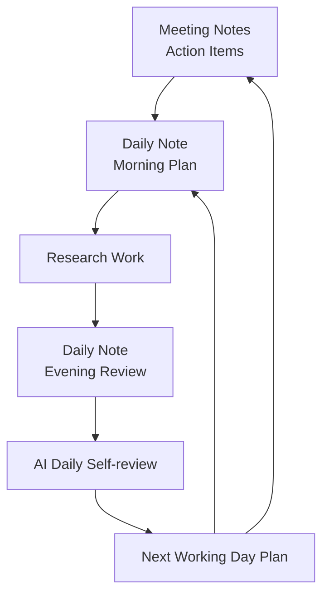

# Research Playbook

> **How do we conduct research every working day?**

This document defines the daily research workflow of the Open Research Playbook.

---

## Why?

Research activities should produce measurable results and reproducible evidence.

Every working day should help researchers:

* Understand the problem before taking action.
* Verify conclusions with evidence.
* Preserve essential research knowledge.
* Enable another researcher to continue the work.

---

## What?

### Research Lifecycle

| Lifecycle | Daily Practice | Output |
|---|---|---|
| 🧠 Think | Prepare the morning plan in the [Daily Note](../templates/G-daily-note.md) | Daily Plan |
| 🔬 Verify | Complete the evening review and use the [AI Daily Self-review Prompt](../templates/E-ai-daily-self-review-prompt.md) | Reviewed Daily Note |
| 📝 Document | Record decisions and evidence in [Meeting Notes](../templates/F-meeting-notes.md) | Reproducible Knowledge |
| 🤝 Transfer | Follow the [Knowledge Transfer Workflow](10-knowledge-transfer.md) | Research Continuity |

### 🧠 Think
Before starting work:
1. Review the current milestone and latest meeting action items.
2. Define today’s tasks and expected deliverables.
3. Decide what evidence must be recorded.
4. Identify possible risks or blockers.
5. Record the plan in the [Daily Note](../templates/G-daily-note.md).

### 🔬 Verify
Before finishing work:
1. Compare completed work with the morning plan.
2. Link each conclusion to supporting evidence.
3. Mark unfinished tasks as Pending or Blocked.
4. Explain unexpected results and differences.
5. Review the Daily Note using the [AI Daily Self-review Prompt](../templates/E-ai-daily-self-review-prompt.md).
AI may identify missing evidence or unclear reasoning, but it must not invent evidence or replace the researcher’s judgment.

### 📝 Document
Record only the information required for another researcher to understand, reproduce, or continue the work.
Use:
- The [Daily Note](../templates/G-daily-note.md) for daily plans, results, and evidence.
- [Meeting Notes](../templates/F-meeting-notes.md) for decisions and measurable action items.
- The research repository for code, configurations, logs, and reproducible results.

### 🤝 Transfer
When research responsibility changes, follow the [Knowledge Transfer Workflow](10-knowledge-transfer.md).
The workflow includes:
1. Preparation by the graduating researcher: [B — Knowledge Transfer Checklist](../templates/B-knowledge-transfer-checklist.md).
2. Verification by the responsible incoming student: [C — Verification Report](../templates/C-verification-report.md).
3. Acceptance by the advisor: [D — Graduation Knowledge Transfer Acceptance Form](../templates/D-acceptance-form.md).

Knowledge transfer is complete only after successful verification and acceptance.

The complete procedure is defined in the The complete procedure is defined in the
[Knowledge Transfer Workflow](10-knowledge-transfer.md#knowledge-transfer-workflow). document.

## Where?
### Related Documents
- [Research Philosophy](01-research-philosophy.md)
- [Getting Started](03-getting-started.md)
- [Knowledge Transfer](10-knowledge-transfer.md)

### Related Templates
- [Daily Note](../templates/G-daily-note.md)
- [Meeting Notes](../templates/F-meeting-notes.md)
- [AI Daily Self-review Prompt](../templates/E-ai-daily-self-review-prompt.md)

## Final Message
**Think before acting, verify with evidence, document what matters**, and transfer knowledge so the next researcher can continue.
