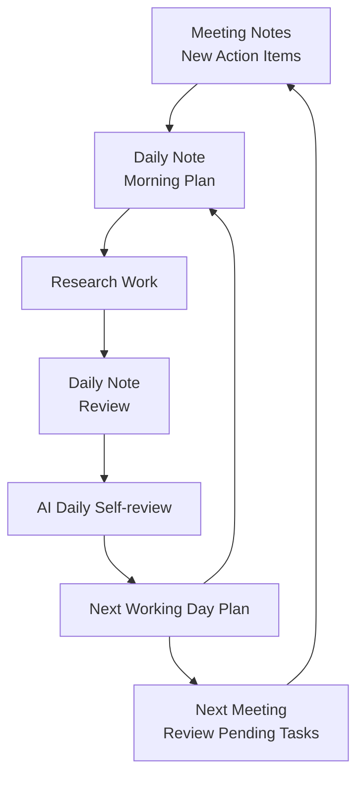

## What?

### Research Lifecycle

| Lifecycle | Daily Practice | Output |
|-----------|----------------|--------|
| 🧠 Think | [Daily Note](../templates/G-daily-note.md) (Morning Plan) | Daily Plan |
| 🔬 Verify | [Daily Note](../templates/G-daily-note.md) (Evening Report) + [AI Daily Self-review Prompt](../templates/E-ai-daily-self-review-prompt.md) | Daily Report |
| 📝 Document | [Meeting Notes](../templates/F-meeting-notes.md) | Reproducible Knowledge |
| 🤝 Transfer | [Knowledge Transfer](10-knowledge-transfer.md) | Research Continuity |

---

### 🧠 Think

Prepare a **[Daily Note](../templates/G-daily-note.md)** before starting work.

---

### 🔬 Verify

Complete the **Evening Report** in the **[Daily Note](../templates/G-daily-note.md)**.

Review it using the **[AI Daily Self-review Prompt](../templates/E-ai-daily-self-review-prompt.md)**.

---

### 📝 Document

Record research knowledge using the **[Meeting Notes](../templates/F-meeting-notes.md)**.

---

### 🤝 Transfer

Prepare research knowledge following the **[Knowledge Transfer](10-knowledge-transfer.md)** workflow.
