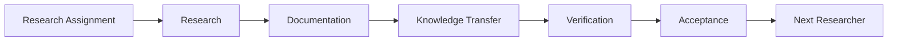

# Knowledge Transfer

> **How do we transfer research knowledge?**

This document describes the workflow for transferring research knowledge from one researcher to the next.

---

## Why?

Research should survive its original author.

The purpose of knowledge transfer is to enable future research, not simply to preserve past research.

---

## What?

### Knowledge Transfer Workflow

Knowledge transfer is complete only after successful verification and acceptance.

### Roles

| Role                | Responsibility                                            |
| ------------------- | --------------------------------------------------------- |
| Outgoing Researcher | Prepare research knowledge for transfer.                  |
| Incoming Researcher | Verify that the research can be reproduced and continued. |
| Advisor             | Confirm successful knowledge transfer.                    |

### Success Criteria

Knowledge transfer is successful when the next researcher can:

* Understand the research.
* Reproduce the results.
* Continue the work independently.

---

## Where?

### Related Documents

* [02-research-playbook.md](02-research-playbook.md)
* [03-getting-started.md](03-getting-started.md)

### Related Templates

* [B-knowledge-transfer-checklist.md](../templates/B-knowledge-transfer-checklist.md)
* [C-verification-report.md](../templates/C-verification-report.md)
* [D-acceptance-form.md](../templates/D-acceptance-form.md)

---

## Final Message

> **Knowledge transfer is complete only when the next researcher can continue the work independently.**
