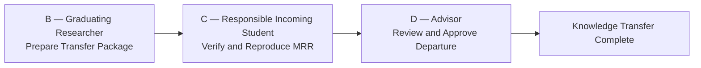

# Knowledge Transfer

> **How do we transfer research knowledge?**

This document describes the workflow for transferring research knowledge from one researcher to the next.

---

## Why?

Research should survive its original author.

The purpose of knowledge transfer is to enable future research, not simply to preserve past research.

---

## What?

### Knowledge Transfer Workflow

Knowledge transfer is complete only after successful verification and acceptance.

### Minimum Reproducible Result (MRR)

**The Minimum Reproducible Result (MRR) consists of the experimental
results presented in the graduating researcher's final defense slides.**

The responsible incoming student must independently reproduce these
results using the transferred research package.

The advisor determines whether the reproduction evidence is sufficient
for accepting the knowledge transfer.

### Roles

| Stage | Responsible Role | Required Output | Completion Condition |
|---|---|---|---|
| B — Preparation | Graduating Researcher | [Knowledge Transfer Checklist](../templates/B-knowledge-transfer-checklist.md) | Required materials and MRR information are complete |
| C — Verification | Responsible Incoming Student | [Verification Report](../templates/C-verification-report.md) | Defense-slide experimental results are independently reproduced |
| D — Acceptance | Advisor | [Graduation Knowledge Transfer Acceptance Form](../templates/D-acceptance-form.md) | Transfer is approved and the graduating researcher may leave |

### Success Criteria

Knowledge transfer is complete only when:
- The graduating researcher has completed the Knowledge Transfer Checklist.
- The responsible incoming student has completed the Verification Report.
- The experimental results presented in the final defense slides have been reproduced.
- The advisor has reviewed the evidence and approved the Acceptance Form.

---

## Where?

### Related Documents

* [02-research-playbook.md](02-research-playbook.md)
* [03-getting-started.md](03-getting-started.md)

### Related Templates

* [B-knowledge-transfer-checklist.md](../templates/B-knowledge-transfer-checklist.md)
* [C-verification-report.md](../templates/C-verification-report.md)
* [D-acceptance-form.md](../templates/D-acceptance-form.md)

---

## Final Message

> **Knowledge transfer is complete only when the next researcher can continue the work independently.**
